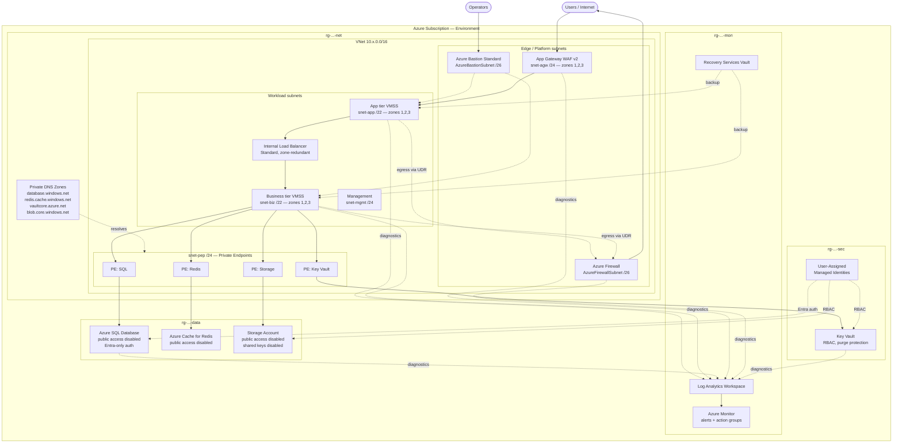

# Architecture — cloudcart 3-Tier Platform

Status: **dev deployed**. This document is the design record — it keeps the
decisions and the rejected alternatives, including ones later overtaken by
events (§6a, §6b). For what is currently built and applied, see
[`../README.md`](../README.md).

---

## 1. Design decisions and trade-offs

Each decision below is recorded with the alternative that was rejected and why.
Where a decision is still open, it is listed in §7.

### 1.1 Single VNet per environment, hub-spoke ready

The brief lists Azure Firewall, Bastion, Application Gateway and all three
workload tiers as one vertical flow, which describes a **single VNet with an
edge/DMZ zone**, not a hub-spoke topology.

We build that, but with two constraints that keep hub-spoke a non-breaking
migration later:

- The `networking` module never assumes the firewall or Bastion live in the
  VNet it creates — their subnet IDs are inputs/outputs, not internal wiring.
- Route tables take a `next_hop_ip` variable rather than reading the firewall
  resource directly, so pointing at a hub firewall is a variable change.

**Rejected:** full hub-spoke from day one. It triples the firewall cost (§1.7),
adds VNet peering and DNS-forwarder complexity, and buys nothing until a second
workload exists. Hub-spoke is correct at the *platform* level, not for a single
application landing zone.

### 1.2 Multiple resource groups per environment, not one

Resource groups are the unit of lifecycle, RBAC scope and deletion blast
radius. Putting a firewall and an autoscaling VMSS in the same RG means the
team that can redeploy compute can also delete the network edge.

| RG | Contents | Lifecycle |
|---|---|---|
| `rg-cloudcart-<env>-<loc>-net` | VNet, subnets, NSGs, route tables, firewall, Bastion, private DNS zones | Slow — changes rarely, tightly controlled |
| `rg-cloudcart-<env>-<loc>-sec` | Key Vault, user-assigned managed identities | Slow — security-team owned |
| `rg-cloudcart-<env>-<loc>-data` | SQL, Redis, storage, private endpoints | Medium — schema/capacity changes |
| `rg-cloudcart-<env>-<loc>-app` | VMSS, ILB, App Gateway, autoscale rules | Fast — deploys with the app |
| `rg-cloudcart-<env>-<loc>-mon` | Log Analytics, action groups, alert rules, Recovery Services vault | Slow — must outlive the resources it observes |

The monitoring RG deliberately sits outside the app RG so that tearing down a
dev app stack does not destroy its own audit trail.

### 1.3 Azure Monitor Agent, never the legacy agent

VM Insights will be delivered through **Azure Monitor Agent (AMA) + Data
Collection Rules**. The Log Analytics agent (MMA/OMS) reached end of support in
August 2024 — any design using `azurerm_virtual_machine_extension` with
`MicrosoftMonitoringAgent`, or the `OmsAgentForLinux` extension, is deploying a
dead product. This is the single most common "deprecated resource" failure in
older Azure Terraform repos.

Concretely: `azurerm_monitor_data_collection_rule` +
`azurerm_monitor_data_collection_rule_association`, with the
`AzureMonitorLinuxAgent` extension on the VMSS.

### 1.4 Diagnostics as a shared module, not copy-paste

Every module needs a diagnostic setting, and every resource type has a
different set of valid log categories. Hardcoding category names per resource
is the main source of "worked last year, fails now" breakage when Azure adds or
renames categories.

The `diagnostics` module takes a resource ID and a workspace ID, reads
`data.azurerm_monitor_diagnostic_categories` for that resource, and generates
`enabled_log` / `metric` blocks dynamically. Every other module calls it. That
is how "no duplicate code" is actually achieved for the cross-cutting concern.

### 1.5 Entra ID-only authentication for SQL — no password to protect

The brief says "no hardcoded secrets." The stronger position is **no secret at
all**. Azure SQL will be configured with `azuread_authentication_only = true`
and an Entra group as the SQL administrator. There is no SQL login, therefore
no password to generate, rotate, store in Key Vault, or leak into state.

Applications authenticate with the tier's user-assigned managed identity.

*If* a SQL login is later required for a legacy component, the fallback is a
`random_password` written to Key Vault — but note this **stores the password in
Terraform state in plaintext**. State is therefore treated as a secret: the
backend storage account gets its own private endpoint, RBAC-only access, and
infrastructure encryption. On recent Terraform + azurerm, write-only arguments
can keep such values out of state entirely; we will verify support for the
specific resource before relying on it rather than assuming.

### 1.6 Subnets as discrete resources — never inline

`azurerm_virtual_network` accepts an inline `subnet` block. Using it *and*
`azurerm_subnet` resources produces permanent drift, where each apply removes
the other's subnets. All subnets will be `azurerm_subnet` resources; the VNet
resource declares address space only. NSG and route table attachment use the
dedicated association resources.

### 1.7 Cost posture differs by environment

This is the biggest financial decision in the brief, and the default reading of
"build all of it in dev, test and prod" is expensive. Approximate list prices,
East US, before data processing charges — **verify against the Azure Pricing
Calculator for your region and agreement**:

| Component | Order of magnitude, per environment, per month |
|---|---|
| Azure Firewall (Standard) | ~$900 + ~$0.016/GB processed |
| Azure Firewall (Premium) | ~$1,200 + data processing |
| Application Gateway WAF v2 | ~$260 minimum + capacity units |
| Azure Bastion (Standard) | ~$140 + outbound data |
| SQL zone-redundant (Business Critical) | Several hundred to low thousands |
| Redis Premium (zone redundant) | ~$400+ |

Running the full stack in three environments is a five-figure monthly bill
dominated by three always-on network appliances that dev and test barely
exercise. The recommendation is in §7, Decision C.

### 1.8 Zone redundancy is not free and not universal

- **VMSS**: `zones = [1,2,3]` with zone balancing — no extra charge, always on.
- **Standard Load Balancer / Public IP**: zone-redundant frontend — no charge.
- **Application Gateway v2**: `zones = [1,2,3]` — no charge, requires v2 SKU.
- **Azure Firewall**: zones are free, but **cross-zone data transfer is billed**.
- **SQL**: zone redundancy requires Premium / Business Critical, or General
  Purpose on supported hardware — a real tier upgrade, not a flag.
- **Redis**: zone redundancy requires the Premium tier.

Not every region offers zones. The `networking` and `vm` modules will take a
`zones` list variable with a validation block rather than hardcoding `[1,2,3]`,
so a non-zonal region degrades to `[]` explicitly instead of failing at apply.

---

## 2. Traffic flow

```
Users ──► Public IP (zone-redundant)
          └─► Application Gateway WAF v2  [snet-agw, zones 1-3]
                └─► App tier VMSS         [snet-app, zones 1-3, no public IP]
                      └─► Internal LB     [snet-biz, zone-redundant frontend]
                            └─► Biz tier VMSS [snet-biz, zones 1-3]
                                  ├─► Private Endpoint ─► Azure SQL
                                  ├─► Private Endpoint ─► Redis
                                  ├─► Private Endpoint ─► Key Vault
                                  └─► Private Endpoint ─► Storage

Operator ─► Azure Bastion [AzureBastionSubnet] ─► VMSS instances (no public IP anywhere)

All egress from app/biz/db/mgmt ──UDR 0.0.0.0/0──► Azure Firewall ──► Internet
```

Two routing rules that break this design if violated, and are the most common
production incidents in this topology:

1. **Never put a `0.0.0.0/0 → firewall` UDR on the Application Gateway subnet.**
   AppGW v2 requires direct outbound access to its control plane. Forcing it
   through the firewall breaks health probes and the gateway goes unhealthy.
2. **Never put a `0.0.0.0/0 → firewall` UDR on `AzureBastionSubnet`.** Bastion
   requires direct outbound connectivity and will fail to provision or drop
   sessions.

Return traffic from the app tier to the App Gateway is intra-VNet, so it uses
the system route and does not create asymmetric routing through the firewall.

---

## 3. Architecture diagram



---

## 4. Security model — Zero Trust mapping

| Control | Implementation |
|---|---|
| No implicit network trust | NSG on every workload subnet, default-deny inbound; tier-to-tier rules are explicit and directional |
| No public compute | Zero public IPs on VMSS; operator access only via Bastion; no SSH/RDP from internet |
| No public data plane | SQL, Redis, Storage, Key Vault all `public_network_access_enabled = false` + private endpoint |
| Identity, not secrets | User-assigned managed identity per tier; Entra-only SQL auth; Key Vault RBAC (not access policies) |
| Least privilege | Per-tier identities with scoped role assignments — app tier cannot read biz tier's secrets |
| Encryption in transit | TLS 1.2 minimum on storage/SQL/Redis; WAF terminates TLS with a Key Vault certificate |
| Egress control | All workload subnets default-route to Azure Firewall; explicit FQDN/network rules |
| Perimeter inspection | WAF v2 in Prevention mode with OWASP managed rule set |
| Auditability | Diagnostic settings on every resource → Log Analytics; activity logs exported |
| Key management | Key Vault with soft-delete + purge protection enabled (irreversible once on — deliberate) |
| Defender-ready | Resources emit the categories Defender for Cloud plans consume; enabling the plans is a subscription-level decision left as a variable |

**Explicitly out of scope unless requested:** customer-managed keys for SQL TDE
and storage encryption. They add a Key Vault dependency loop (the vault must
exist and be reachable before the data resource, and its deletion bricks the
data) that deserves its own decision rather than being switched on silently.

---

## 5. Terraform standards applied

- **Provider pinning**: `azurerm ~> 4.0` with the exact patch locked by
  `.terraform.lock.hcl` (committed). Azure provider v4 requires an explicit
  `subscription_id` and changes resource-provider registration behaviour — the
  existing v3 config in this repo does not carry over unchanged.
- **Terraform version**: `>= 1.9` floor for the validation and `moved` features
  used; a higher floor if write-only arguments are adopted (§1.5).
- **Naming**: dedicated `naming` module implementing Azure CAF abbreviations,
  so no resource name is ever a literal string in a calling module.
- **Tags**: dedicated `tags` module producing a merged, validated tag map —
  mandatory tags enforced by `validation` blocks, not convention.
- **Validation**: every module input that has a bounded domain (SKU, tier,
  CIDR, zone list, environment) gets a `validation` block. Failures surface at
  plan time, not after 20 minutes of apply.
- **No `count` for optionality on named resources**: `for_each` over maps, so
  adding a subnet does not re-index and destroy unrelated ones.
- **Outputs**: every module exports IDs consumed downstream plus a small number
  of human-useful values; sensitive outputs marked `sensitive`.
- **State**: remote azurerm backend, one state file per environment, partial
  backend config supplied at `init`.

---

## 6. Module build order

Foundation first, then the resources that everything else reports into, then
the network, then data, then compute, then observability wiring.

| # | Module | Depends on | Why here |
|---|---|---|---|
| 1 | `naming` | — | Pure computation, no provider calls. Everything consumes it. |
| 2 | `tags` | — | Same. |
| 3 | `resource-group` | naming, tags | The container everything lands in. |
| 4 | `log-analytics` | 3 | Must exist before any diagnostic setting can target it. |
| 5 | `diagnostics` | 4 | Shared helper — built early so modules 6+ can call it. |
| 6 | `networking` | 3 | VNet + subnets; the address space everything binds to. |
| 7 | `nsg` | 6 | Attaches to subnets. |
| 8 | `route-table` | 6 | Needs subnets; firewall IP injected later as a variable. |
| 9 | `firewall` | 6, 8 | Provides the next-hop the route tables point at. |
| 10 | `private-dns` | 6 | Zones + VNet links, required before any private endpoint resolves. |
| 11 | `managed-identity` | 3 | Identities must exist before RBAC on vault/storage. |
| 12 | `key-vault` | 6, 10, 11 | Private endpoint + RBAC assignments. |
| 13 | `storage` | 6, 10, 11 | Same shape as key-vault. |
| 14 | `bastion` | 6 | Independent of workload; enables operator access early. |
| 15 | `sql` | 6, 10, 11 | Private endpoint + Entra admin. |
| 16 | `redis` | 6, 10 | Private endpoint. |
| 17 | `load-balancer` | 6 | Internal LB for the business tier. |
| 18 | `application-gateway` | 6, 12 | Needs the vault for its TLS certificate. |
| 19 | ~~`vm`~~ → `aks` | 6, 7, 11 | **Superseded.** VMSS never built; compute is AKS. See §6b. |
| 20 | ~~`autoscale`~~ | — | **Dropped.** The cluster autoscaler lives on the node pool, inside `aks`. |
| 21 | `recovery-services` | 3 | Vault and policies. Its original subject — the scale sets — never existed, so it protects nothing. See below. |
| 22 | `monitor` | 4, and all | Alerts reference resources that must already exist. |

Modules 1–2 are additions to your original list. A "naming convention module"
and "tags module" appear in your Terraform Standards section but not in the
repository structure — they are foundational, so they are listed explicitly.

Rows 19–21 are left in place rather than rewritten, because the build order as
*planned* is part of the record. What changed is documented in §6b.

**`recovery-services` deserves its own note.** It was specified to back up the
VM Scale Sets. With compute on AKS, almost nothing in this platform is left for
a Recovery Services vault to protect: SQL carries its own short-term and
long-term retention, storage is blob-only with versioning and soft delete
already enabled, and AKS backup is a different resource family entirely
(`Microsoft.DataProtection`, a Backup vault, plus an in-cluster extension).

The module therefore deploys a vault and its policies and creates **no
protected items**. Both are free — Azure bills per protected instance — so the
configuration is deployed and verifiable, ready for whatever qa, stage or prod
put in front of it. The alternative, a module that exists only as untested
code, was rejected: this platform has already been bitten once by
configuration that looked correct and had never run.

---

## 6a. Region selection is a subscription constraint, not a preference

The platform was originally planned for **East US**. It runs in **Central US**
because Azure SQL Database provisioning is **restricted in East US on this
subscription**:

```
Status: "ProvisioningDisabled"
Message: "Provisioning is restricted in this region."
```

This is a per-subscription restriction, not a capacity shortage, and it does
not resolve on its own. Trial subscriptions generally cannot get an exception
granted.

Seven regions were probed by creating a throwaway logical server, which is free
and takes under a minute:

| Region | Azure SQL provisioning |
|---|---|
| East US | Blocked — `ProvisioningDisabled` |
| East US 2 | Blocked — `RegionDoesNotAllowProvisioning` |
| West US 2 | Blocked |
| West Europe | Blocked — `RegionDoesNotAllowProvisioning` |
| **Central US** | **Allowed** — selected |
| Central India | Allowed — subscription home region |
| Southeast Asia | Allowed |

Central US was chosen over Central India to keep the platform in a US region
with a comparable latency profile, and it carries the same 4 vCPU trial quota.

**The lesson worth carrying forward:** verify that every service the
architecture depends on can actually be provisioned in the target region *for
the target subscription*, before building anything. Regional availability
published in documentation is necessary but not sufficient — subscription-level
restrictions are invisible until an apply fails.

The cost of discovering this at module 15 was a rebuild of 28 resources with no
data in them. Discovering it after compute, cache and gateway existed would
have been materially worse. This is why `location` is a variable consumed by
`naming` rather than a literal anywhere in the modules: the move was a one-line
change plus an apply.

Splitting the database into an allowed region while leaving the rest in East US
was rejected — the application tier would cross regions on every query, which
is the wrong shape for a three-tier platform and adds cross-region egress
charges to every request.

---

## 6b. Compute is AKS, not VM Scale Sets

The platform was designed around VM Scale Sets: an application tier and a
business tier, each its own scale set in its own subnet, with an NSG between
them. It now runs a single AKS cluster instead.

**What this changes, and it is not a detail.** The three-tier boundary moves
from the network into the cluster:

| | VM Scale Sets | AKS |
|---|---|---|
| Tiers are | separate subnets | namespaces in one cluster |
| Boundary enforced by | NSG, by the Azure platform | Kubernetes network policy, by the cluster |
| A misconfigured workload | still cannot cross the subnet boundary | can, if policy is absent or wrong |
| Identity | VM managed identity | Entra Workload Identity, federated per service account |

Trust moves from the platform into the cluster. That is a genuine reduction in
defence depth, and it is why `network_policy` is not an optional input on the
`aks` module — a precondition rejects `null` outright. Without a policy engine
every pod reaches every other pod regardless of namespace, and the separation
this document claims does not exist.

A second consequence is easy to miss. Under Azure CNI Overlay a pod's traffic
leaving the cluster is **SNATed to its node address**. Every NSG rule written
against the old tier subnets silently stops matching. The private endpoint NSG
had to be re-sourced from the AKS node subnet, or every call from a pod to SQL,
Redis, Key Vault or Storage would have hit the default deny — a failure that
looks like a data-tier outage and is a network rule.

The same "the egress address is not what you wrote down" trap has a third form,
and this one cost a cluster. On a public cluster restricted by an API server
allowlist, the **nodes** reach their own control plane over the public endpoint.
AKS appends the cluster's egress address to that allowlist automatically only
when it owns the outbound path — `loadBalancer` with managed IPs, or
`managedNATGateway`. This platform egresses through a NAT Gateway created by the
`networking` module, so `outbound_type` is `userAssignedNATGateway` and the
append does not happen. The allowlist held only the operator's address, the
nodes egressed from the NAT Gateway's, and kubelet was refused by the very API
server it was trying to join.

Nothing surfaces this. The apply runs for fifteen minutes; the cluster reports
`provisioningState: Updating` indefinitely; the node bootstrap (`vmssCSE`) times
out with exit code 51 and AKS deletes and recreates the node every ~14 minutes
forever. The allowlist blackholes unauthorised sources rather than refusing
them, so the only evidence is a `curl` that transferred zero bytes. The `aks`
module now takes the cluster's egress address as a separate `node_egress_ip_ranges`
input and rejects the combination at plan time, because there is no cheaper
place to catch it.

A related but milder hazard: operator addresses are residential and change
without notice. That locks out `kubectl` rather than the cluster, but it makes
the allowlist a value that drifts on its own.

**dev's cluster is deliberately not highly available**, and the reason is
arithmetic rather than preference:

```
3 nodes across 3 zones = 6 vCPU    quota is 4     OVER
2 nodes                = 4 vCPU    6 on upgrade   OVER
1 node                 = 2 vCPU    4 on upgrade   fits
```

AKS adds a surge node during upgrades, so even two nodes would leave a cluster
that cannot be patched. The `availability_summary` output states the degraded
posture in plain language so a development cluster never reads as
production-shaped, and three production guardrails in the `profile` module
reject a prod environment that is not HA, not private, or on the Free SKU tier.

**Module inventory changed.** `vm` was never built; `aks` replaces it.
`autoscale` is obsolete as designed — it was VM Scale Set autoscale rules,
where AKS uses the cluster autoscaler configured on the node pool itself, so
that behaviour now lives inside the `aks` module. The two load balancers were
deployed and then destroyed: AKS provisions and manages its own for a
`Service` of type `LoadBalancer`, so keeping them was roughly $40/month for
nothing. The `load-balancer` module remains in the repository, unused.

---

## 7. Open decisions — needed before module 1

**Decision A — Relationship to the existing `cloudcart` config.**
The repository root already holds a working VM + AKS deployment on azurerm
v3.117, with live state in an Azure Storage backend. The new `terraform/` tree
is a different architecture on a different provider major version. Options:
keep both (root config frozen, new tree greenfield), migrate and retire the
root config, or fold AKS into the new design as a fourth tier.

**Decision B — Topology.** Single VNet per environment as designed above, or
hub-spoke with a shared hub carrying firewall and Bastion.

**Decision C — Environment cost posture.** Full parity across dev/test/prod is
roughly a five-figure monthly bill. The pragmatic alternative: prod gets
firewall + WAF + Bastion + zone-redundant data tier; dev/test share a single
hub firewall (or use NAT Gateway for egress, ~$35/month), run WAF v2 without
zone redundancy, and use non-zone-redundant SQL/Redis tiers. Module code is
identical; only `terraform.tfvars` differs.

**Decision D — State granularity.** One state file per environment (matches
your `environments/{dev,test,prod}` layout, simple, but a single plan touches
all 22 modules), or layered state per environment (`00-platform`, `10-data`,
`20-app`) for smaller blast radius and faster plans at the cost of cross-layer
data sources.
