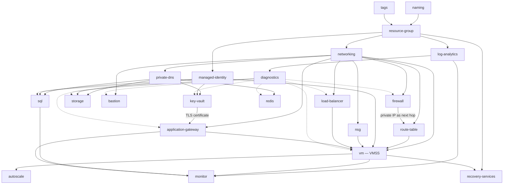

# Dependency Graph and Deployment Order

---

## 1. Module dependency graph

Solid arrows are hard dependencies (resource ID or attribute consumed).
Dotted arrows are soft dependencies (the resource is configured to *report
into* the target, but does not need it to exist for its own creation logic —
Terraform still orders them).



### Critical path

The longest chain, which sets the minimum wall-clock deployment time:

```
resource-group → networking → firewall → route-table → vm → autoscale
```

Azure Firewall provisioning dominates it (typically 10–20 minutes), followed by
Application Gateway (10–15 minutes) and Bastion (~10 minutes). A cold apply of
a full environment should be expected to take **35–50 minutes**, most of it
waiting on three network appliances that provision in parallel once the VNet
exists.

### Parallelism

After `networking` completes, these branches are independent and Terraform will
run them concurrently:

- `firewall` + `route-table`
- `bastion`
- `private-dns` → `key-vault` / `storage` / `sql` / `redis`
- `load-balancer`

`vm` is the join point — it is the last thing to start and gates `autoscale`,
`recovery-services` and most of `monitor`.

---

## 2. Deployment order

### Phase 0 — Bootstrap (once per subscription, outside this codebase)

The backend cannot live in the state it stores. Created manually or by a
separate bootstrap config:

1. Resource group for Terraform state
2. Storage account — versioning on, public access off, `shared_access_key_enabled = false`
3. Blob container per environment
4. Entra service principal or workload identity federation, with `Storage Blob Data Contributor` on the container
5. RBAC for the deployment identity on the target subscription

Bootstrap state is intentionally not remote. It is small, changes almost never,
and making it self-hosting creates a circular dependency.

### Phase 1 — Foundation

```
naming → tags → resource-group → log-analytics → diagnostics
```

No network, no cost beyond the workspace. Establishes the naming contract and
the telemetry sink that every later phase writes into.

### Phase 2 — Network

```
networking → nsg → firewall → route-table → private-dns → bastion
```

Ordering note: `route-table` is applied **after** `firewall` because it needs
the firewall's private IP as its next hop. Attaching route tables to subnets
before the firewall exists would black-hole all egress.

At the end of Phase 2 the environment is reachable by operators (Bastion) and
has controlled egress, but hosts nothing.

### Phase 3 — Identity and secrets

```
managed-identity → key-vault → storage
```

Identities first: role assignments on the vault and storage account reference
principal IDs, so the identities must pre-exist. Key Vault before storage
because the storage account may take a customer-managed key later.

### Phase 4 — Data

```
sql → redis
```

Both are private-endpoint-only from creation — never created public and locked
down afterwards, which would leave a window of public exposure.

### Phase 5 — Compute and delivery

```
load-balancer → application-gateway → vm (VMSS) → autoscale
```

Load balancer and gateway first so the VMSS can be created already associated
with their backend pools. Creating a VMSS and attaching it to a backend pool
afterwards causes a full instance rolling update.

### Phase 6 — Operations

```
recovery-services → monitor
```

Backup policies and alert rules reference resources that must already exist.
Alerts land last so that the initial deployment does not page anyone while
resources are still coming up.

---

## 3. Per-environment rollout

```
dev  →  validate  →  test  →  soak  →  prod
```

Identical module code at every stage. Only `terraform.tfvars` differs — SKUs,
instance counts, zone lists and the cost-posture switches from ARCHITECTURE.md
§7 Decision C. If an environment needs a code change rather than a variable
change, the module has a missing input; that is treated as a defect.

---

## 4. Commands

Backends are partial; environment-specific values come from a config file that
is never committed.

```bash
cd terraform/environments/dev

terraform init -backend-config=backend.conf
terraform fmt -recursive -check
terraform validate
terraform plan  -var-file=terraform.tfvars -out=tfplan
terraform apply tfplan
```

Gates that must pass before an apply reaches prod:

| Gate | Tool | Blocks on |
|---|---|---|
| Format | `terraform fmt -check -recursive` | Any diff |
| Syntax + types | `terraform validate` | Any error |
| Policy / security | `checkov`, `tfsec` or `trivy config` | High severity |
| Cost delta | `infracost diff` | Threshold breach, reviewed not auto-blocked |
| Plan review | Human | Any destroy of a stateful resource |

`terraform plan` must be clean — no unexpected diffs on a re-plan immediately
after apply. A resource that shows perpetual drift is a module defect, most
often inline-vs-separate subnet blocks (ARCHITECTURE.md §1.6) or a tag being
mutated by an Azure Policy outside Terraform's view.

---

## 5. Rollback

- **Compute** (`vm`, `autoscale`): safe to `terraform apply` a previous commit. VMSS instances are cattle.
- **Delivery** (`application-gateway`, `load-balancer`): safe, causes a brief outage on the affected listener.
- **Data** (`sql`, `redis`, `storage`): **not** safe to roll back by re-apply. Recovery is through point-in-time restore, not Terraform. All three carry `prevent_destroy` in prod.
- **Network** (`networking`, `firewall`, `route-table`): a rollback that removes a subnet fails while resources occupy it. Route table changes are the fastest way to cause a total environment outage — they apply in seconds and there is no health check.
- **Key Vault**: purge protection makes deletion irreversible-by-design for 90 days. A rolled-back vault name cannot be immediately reused.
